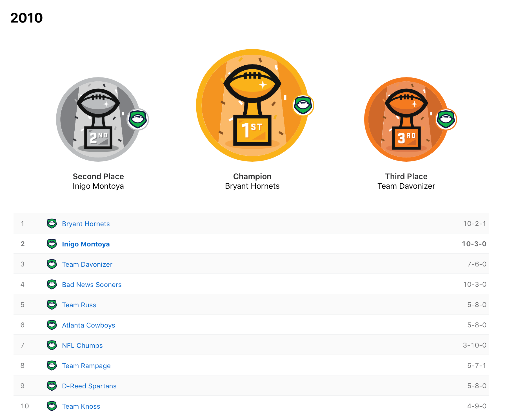
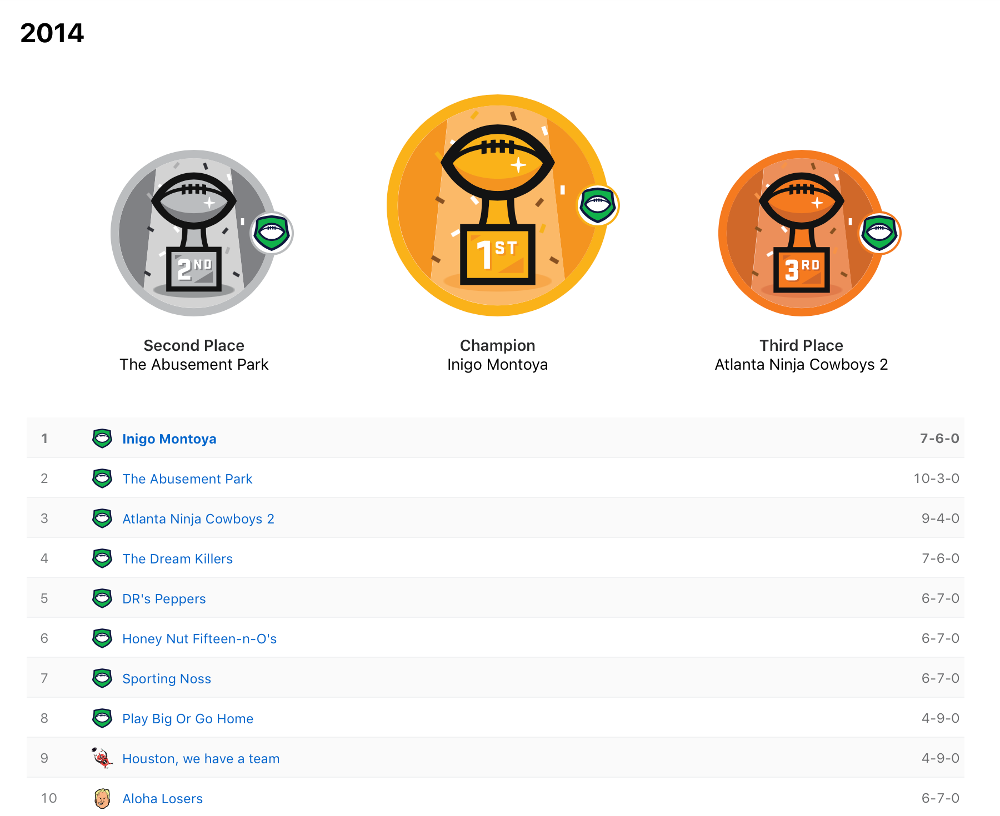

> Remember kid, there's heroes and there's legends. Heroes get remembered but legends never die...

The Sandlot
<!-- HTML -->

<!-- Slideshow container -->

  <!-- Full-width images with number and caption text -->
  

    
  

  

    
  

  

    
  

    

    
  

    

    
  

  

    
  

    

    
  

    

    
  

    

    
  

    

    
  

  <!-- Next and previous buttons -->
  <a class="prev" onclick="plusSlides(-1)">&#10094;</a>
  <a class="next" onclick="plusSlides(1)">&#10095;</a>

 

<!-- The dots/circles -->

   
   
  
  
   
   
   
  
  
   

<!-- CSS -->

#### Overall Regular Season Records
___

<table class="wdn_responsive_table center" id="t556943"><caption>Overall Regular Season Records</caption><thead> <tr> <th colspan="1" id="t556943_row_0col_0">Owner</th> <th colspan="1" id="t556943_row_0col_1"># Seasons</th> <th colspan="1" id="t556943_row_0col_2">Record</th> <th colspan="1" id="t556943_row_0col_3">Win %</th> </tr></thead><tbody> <tr> <td colspan="1" headers="t556943_row_0col_0" data-header="Owner">Katie Beth</td> <td colspan="1" headers="t556943_row_0col_1" data-header="# Seasons">1</td> <td colspan="1" headers="t556943_row_0col_2" data-header="Record">9 - 4</td> <td colspan="1" headers="t556943_row_0col_3" data-header="Win %">69.2</td> </tr> <tr> <td colspan="1" headers="t556943_row_0col_0" data-header="Owner">Jonathan</td> <td colspan="1" headers="t556943_row_0col_1" data-header="# Seasons">10</td> <td colspan="1" headers="t556943_row_0col_2" data-header="Record">81 - 49</td> <td colspan="1" headers="t556943_row_0col_3" data-header="Win %">62.3</td> </tr> <tr> <td colspan="1" headers="t556943_row_0col_0" data-header="Owner">Jeremy</td> <td colspan="1" headers="t556943_row_0col_1" data-header="# Seasons">5</td> <td colspan="1" headers="t556943_row_0col_2" data-header="Record">40 - 25</td> <td colspan="1" headers="t556943_row_0col_3" data-header="Win %">61.5</td> </tr> <tr> <td colspan="1" headers="t556943_row_0col_0" data-header="Owner">Davis</td> <td colspan="1" headers="t556943_row_0col_1" data-header="# Seasons">10</td> <td colspan="1" headers="t556943_row_0col_2" data-header="Record">77 - 52 - 1</td> <td colspan="1" headers="t556943_row_0col_3" data-header="Win %">59.2</td> </tr> <tr> <td colspan="1" headers="t556943_row_0col_0" data-header="Owner">David</td> <td colspan="1" headers="t556943_row_0col_1" data-header="# Seasons">10</td> <td colspan="1" headers="t556943_row_0col_2" data-header="Record">70 - 60</td> <td colspan="1" headers="t556943_row_0col_3" data-header="Win %">53.8</td> </tr> <tr> <td colspan="1" headers="t556943_row_0col_0" data-header="Owner">Paul</td> <td colspan="1" headers="t556943_row_0col_1" data-header="# Seasons">5</td> <td colspan="1" headers="t556943_row_0col_2" data-header="Record">34 - 31</td> <td colspan="1" headers="t556943_row_0col_3" data-header="Win %">52.3</td> </tr> <tr> <td colspan="1" headers="t556943_row_0col_0" data-header="Owner">Rob</td> <td colspan="1" headers="t556943_row_0col_1" data-header="# Seasons">9</td> <td colspan="1" headers="t556943_row_0col_2" data-header="Record">55 - 61 - 1</td> <td colspan="1" headers="t556943_row_0col_3" data-header="Win %">47.0</td> </tr> <tr> <td colspan="1" headers="t556943_row_0col_0" data-header="Owner">Daniel</td> <td colspan="1" headers="t556943_row_0col_1" data-header="# Seasons">10</td> <td colspan="1" headers="t556943_row_0col_2" data-header="Record">53 - 75 - 2</td> <td colspan="1" headers="t556943_row_0col_3" data-header="Win %">40.8</td> </tr> <tr> <td colspan="1" headers="t556943_row_0col_0" data-header="Owner">Joel</td> <td colspan="1" headers="t556943_row_0col_1" data-header="# Seasons">7</td> <td colspan="1" headers="t556943_row_0col_2" data-header="Record">37 - 54</td> <td colspan="1" headers="t556943_row_0col_3" data-header="Win %">40.7</td> </tr> <tr> <td colspan="1" headers="t556943_row_0col_0" data-header="Owner">Jeff/Liz</td> <td colspan="1" headers="t556943_row_0col_1" data-header="# Seasons">5</td> <td colspan="1" headers="t556943_row_0col_2" data-header="Record">26 - 39</td> <td colspan="1" headers="t556943_row_0col_3" data-header="Win %">40.0</td> </tr></tbody></table>