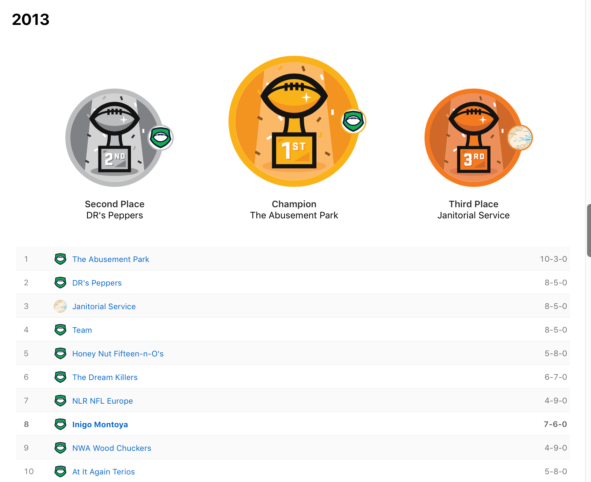
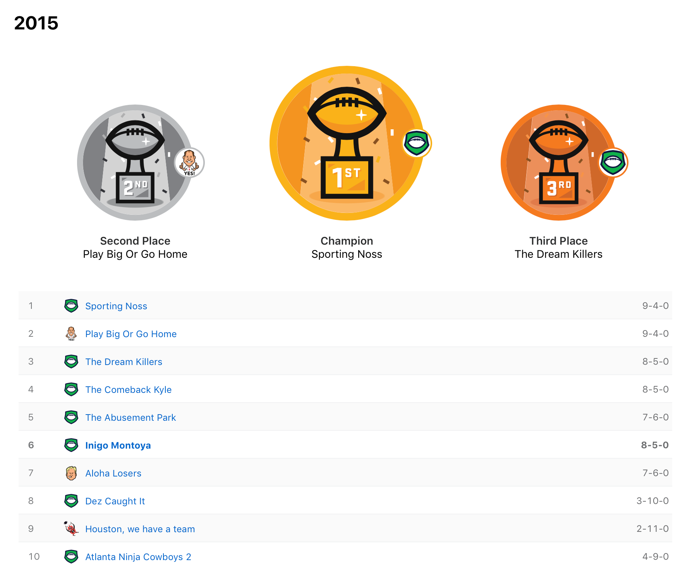

> Remember kid, there's heroes and there's legends. Heroes get remembered but legends never die...

The Sandlot
<!-- HTML -->

<!-- Slideshow container -->

  <!-- Full-width images with number and caption text -->
  

    
  

  

    
  

  

    
  

    

    
  

    

    
  

  

    
  

    

    
  

    

    
  

    

    
  

    

    
  

  <!-- Next and previous buttons -->
  <a class="prev" onclick="plusSlides(-1)">&#10094;</a>
  <a class="next" onclick="plusSlides(1)">&#10095;</a>

 

<!-- The dots/circles -->

   
   
  
  
   
   
   
  
  
   

<!-- CSS -->

___

<table class="tg">
  <tr>
    <th class="tg-1kv1">Owner</th>
    <th class="tg-1kv1"># Seasons</th>
    <th class="tg-1kv1">Record</th>
    <th class="tg-1kv1">Win %</th>
  </tr>
  <tr>
    <td class="tg-cyr5">Katie Beth</td>
    <td class="tg-qtxd">1</td>
    <td class="tg-qtxd">9 - 4</td>
    <td class="tg-qtxd">69.2</td>
  </tr>
  <tr>
    <td class="tg-fuxe">Jonathan</td>
    <td class="tg-7jts">10</td>
    <td class="tg-7jts">81 - 49</td>
    <td class="tg-7jts">62.3</td>
  </tr>
  <tr>
    <td class="tg-cyr5">Jeremy</td>
    <td class="tg-qtxd">5</td>
    <td class="tg-qtxd">40 - 25</td>
    <td class="tg-qtxd">61.5</td>
  </tr>
  <tr>
    <td class="tg-fuxe">Davis</td>
    <td class="tg-7jts">10</td>
    <td class="tg-7jts">77 - 52 - 1</td>
    <td class="tg-7jts">59.2</td>
  </tr>
  <tr>
    <td class="tg-cyr5">David</td>
    <td class="tg-qtxd">10</td>
    <td class="tg-qtxd">70 - 60</td>
    <td class="tg-qtxd">53.8</td>
  </tr>
  <tr>
    <td class="tg-fuxe">Paul</td>
    <td class="tg-7jts">5</td>
    <td class="tg-7jts">34 - 31</td>
    <td class="tg-7jts">52.3</td>
  </tr>
  <tr>
    <td class="tg-cyr5">Rob</td>
    <td class="tg-qtxd">9</td>
    <td class="tg-qtxd">55 - 61 - 1</td>
    <td class="tg-qtxd">47.0</td>
  </tr>
  <tr>
    <td class="tg-fuxe">Daniel</td>
    <td class="tg-7jts">10</td>
    <td class="tg-7jts">53 - 75 - 2</td>
    <td class="tg-7jts">40.8</td>
  </tr>
  <tr>
    <td class="tg-cyr5">Joel</td>
    <td class="tg-qtxd">7</td>
    <td class="tg-qtxd">37 - 54</td>
    <td class="tg-qtxd">40.7</td>
  </tr>
  <tr>
    <td class="tg-fuxe">Jeff/Liz</td>
    <td class="tg-7jts">5</td>
    <td class="tg-7jts">26 - 39</td>
    <td class="tg-7jts">40.0</td>
  </tr>
</table>