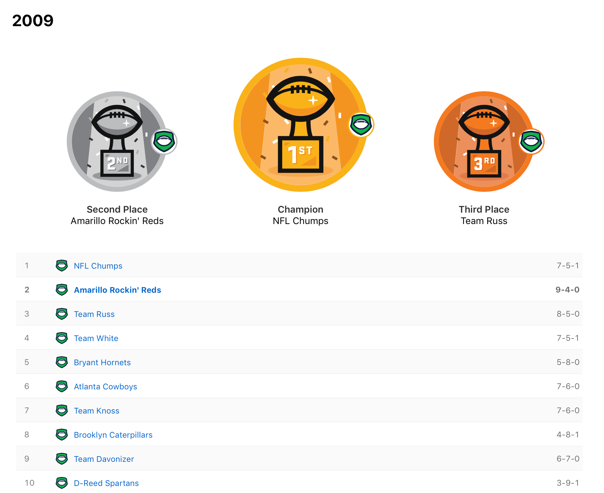
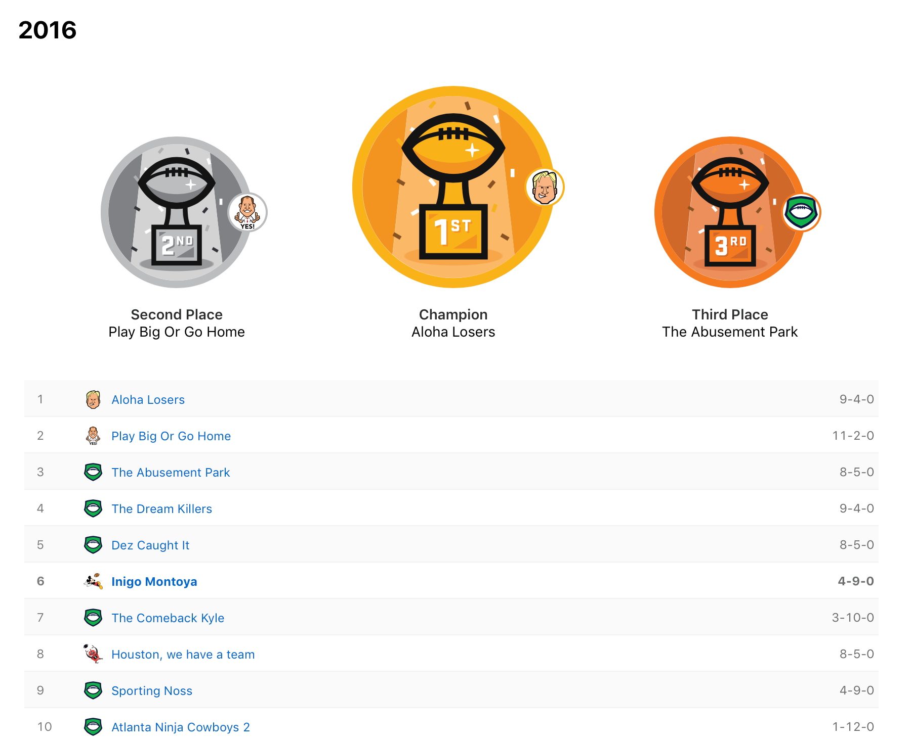
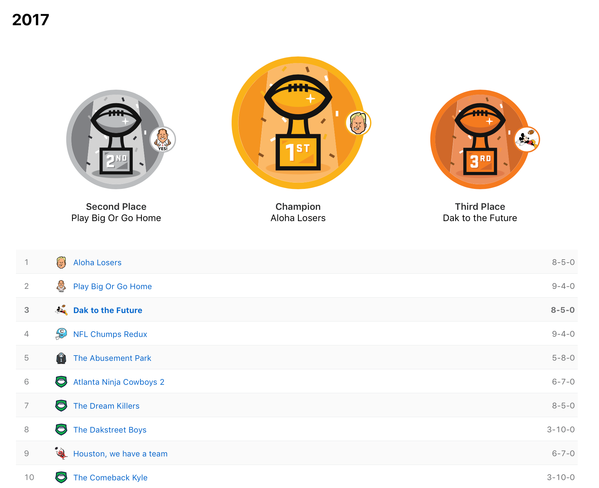

> Remember kid, there's heroes and there's legends. Heroes get remembered but legends never die...

The Sandlot
<!-- HTML -->

<!-- Slideshow container -->

  <!-- Full-width images with number and caption text -->
  

    
  

  

    
  

  

    
  

    

    
  

    

    
  

  

    
  

    

    
  

    

    
  

    

    
  

    

    
  

  <!-- Next and previous buttons -->
  <a class="prev" onclick="plusSlides(-1)">&#10094;</a>
  <a class="next" onclick="plusSlides(1)">&#10095;</a>

 

<!-- The dots/circles -->

   
   
  
  
   
   
   
  
  
   

<!-- CSS -->

___
<table style="width: auto; height: auto; margin-left: auto; margin-right: auto;" cellspacing="0" cellpadding="0">
<tbody>
<tr>
<td valign="top">

<strong>Owner</strong>

</td>
<td valign="top">

<strong># Seasons</strong>

</td>
<td valign="top">

<strong>Record</strong>

</td>
<td valign="top">

<strong>Win %</strong>

</td>
</tr>
<tr>
<td valign="top">

Katie Beth

</td>
<td valign="top">

1

</td>
<td valign="top">

9 - 4

</td>
<td valign="top">

69.2

</td>
</tr>
<tr>
<td valign="top">

Jonathan

</td>
<td valign="top">

10

</td>
<td valign="top">

81 - 49

</td>
<td valign="top">

62.3

</td>
</tr>
<tr>
<td valign="top">

Jeremy

</td>
<td valign="top">

5

</td>
<td valign="top">

40 - 25

</td>
<td valign="top">

61.5

</td>
</tr>
<tr>
<td valign="top">

Davis

</td>
<td valign="top">

10

</td>
<td valign="top">

77 - 52 - 1

</td>
<td valign="top">

59.2

</td>
</tr>
<tr>
<td valign="top">

David

</td>
<td valign="top">

10

</td>
<td valign="top">

70 - 60

</td>
<td valign="top">

53.8

</td>
</tr>
<tr>
<td valign="top">

Paul

</td>
<td valign="top">

5

</td>
<td valign="top">

34 - 31

</td>
<td valign="top">

52.3

</td>
</tr>
<tr>
<td valign="top">

Rob

</td>
<td valign="top">

9

</td>
<td valign="top">

55 - 61 - 1

</td>
<td valign="top">

47.0

</td>
</tr>
<tr>
<td valign="top">

Daniel

</td>
<td valign="top">

10

</td>
<td valign="top">

53 - 75 - 2

</td>
<td valign="top">

40.8

</td>
</tr>
<tr>
<td valign="top">

Joel

</td>
<td valign="top">

7

</td>
<td valign="top">

37 - 54

</td>
<td valign="top">

40.7

</td>
</tr>
<tr>
<td valign="top">

Jeff/Liz

</td>
<td valign="top">

5

</td>
<td valign="top">

26 - 39

</td>
<td valign="top">

40.0

</td>
</tr>
</tbody>
</table>